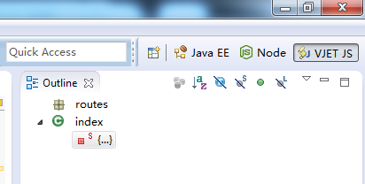
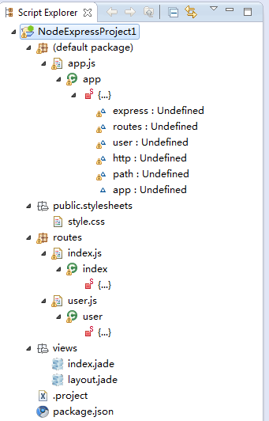

# Blog

## What's new in Eclipse 4.3 Kepler

Open [this link](http://127.0.0.1:59303/help/index.jsp?topic=%2Forg.eclipse.platform.doc.user%2FwhatsNew%2Fplatform_whatsnew.html&cp=0_6)
 after starting [Eclipe Kepler](http://www.eclipse.org/downloads/index-developer.php), or just Help -> Help Contents
or Help -> Welcome

- Better multi-monitor support with Detached windows 
- Performance enhancements
- Initial Eclipse 4 API released

<!-- 
## Code Assist

Since 0.4 there is option to have
 [completions.json](https://github.com/Nodeclipse/nodeclipse-1/blob/master/org.nodeclipse.ui/src/org/nodeclipse/ui/contentassist/completions.json)
 as external file. You can adjust code templates, then just go to Preferences -> Nodeclipse, and point Completions.json Path: to your local file.  
Please share your changes with other users. [Contact us](https://github.com/Nodeclipse/nodeclipse-1#contacts).  
-->

## Recommendations

### Sources

Put all sources under <code>src</code> folder.

This will help to separate project code from libraries code.

Or even better organize as <code>src/main</code> and <code>src/test</code>

## VJET

Paul has tried [VJET](http://eclipse.org/vjet/) 0.10.0 together with Nodeclipse.

### Eclipse configuration

Use default simple Eclipse configuration:

	<?xml version="1.0" encoding="UTF-8"?>
	<projectDescription>
		<name>NodeExpressProject1</name>
		<comment></comment>
		<projects>
		</projects>
		<buildSpec>
		</buildSpec>
		<natures>
			<nature>org.nodeclipse.ui.NodeNature</nature>
		</natures>
	</projectDescription>
	
This one configuration below can produce beautiful picture, see below, but 
**Unfortunately it fails after packages download into <code>node_modules</code>.**

	<?xml version="1.0" encoding="UTF-8"?>
	<projectDescription>
		<name>NodeExpressProject1</name>
		<comment></comment>
		<projects>
		</projects>
		<buildSpec>
			<buildCommand>
				<name>org.eclipse.vjet.eclipse.core.builder</name>
				<arguments>
				</arguments>
			</buildCommand>
		</buildSpec>
		<natures>
			<nature>org.nodeclipse.ui.NodeNature</nature>
			<nature>org.eclipse.vjet.core.nature</nature>
		</natures>
	</projectDescription>

Other order of natures causes build error (and irrevocably spoils project layout) :

	Errors occurred during the build.
	Errors running builder 'VJET Script Builder' on project 'NodeExpressProject1'.
	-3	

So stick to 1st example provided.

### View in VJET perspective

This only works until packages download into <code>node_modules</code>.

VJET [JavaScript] Editor has outline (seen on the first picture).  
    
For VJET Editor context assist check [wiki](http://wiki.eclipse.org/VJET/NodeJS).
 
VJET also comes with good Eclipse Help (Help -> Help contents).

**Running Node.js project is NOT currently supported**, so you need to switch back to Node perspective.

VJET browsing perspective doesn't support Node projects without vjet nature.
But with vjet nature, it again gets blurred, after packages download into <code>node_modules</code>.

### VJET conclusion

Only editor can do some help.

